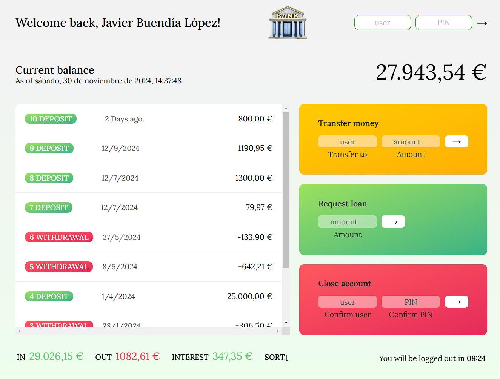

# What is this app??

&nbsp;&nbsp;👉 This is a pretty complete fake bank app where you can log in and watch different options inside. You can see movements, total Balance, incomes, out and interests. Then you can do some basic operations like transfer an amount of money to another existent user or loan some money mean while you have at least one movement that represent the 10% of the amount you are going to ask. And also you can delete that fake account if you wish.

&nbsp;&nbsp;👉 Obviously all users are fake and here you can find the loggin data of those users. Also, when you log in with one of them, you can find a current and live hour, the currency and locale time/date deppending on the user's country origin (all those data are setted inside the script).

&nbsp;&nbsp;👉 It is important to remark that all operation you are going to do, are just temporal operations and whe you refresh the navigator web page, everything is going to restore as default coded in script. This is just a JavaScript code, on local development and at the momento I didn't do nothing on external server. I'm still learning 🤣🤣😅😅

&nbsp;&nbsp;👉 All script is commented to can understand step by step the code and to can run it, just clone or download the zip folder of the repository and open it with your favorite IDE, then finally execute the html with live server and enjoy trying this JavaScript web app.

&nbsp;&nbsp;👉 User and passwords to try the web app:

jbl 1111

jd 2222

hs 3333

I attach the flowchart here to can follow the logic flow of the app:

